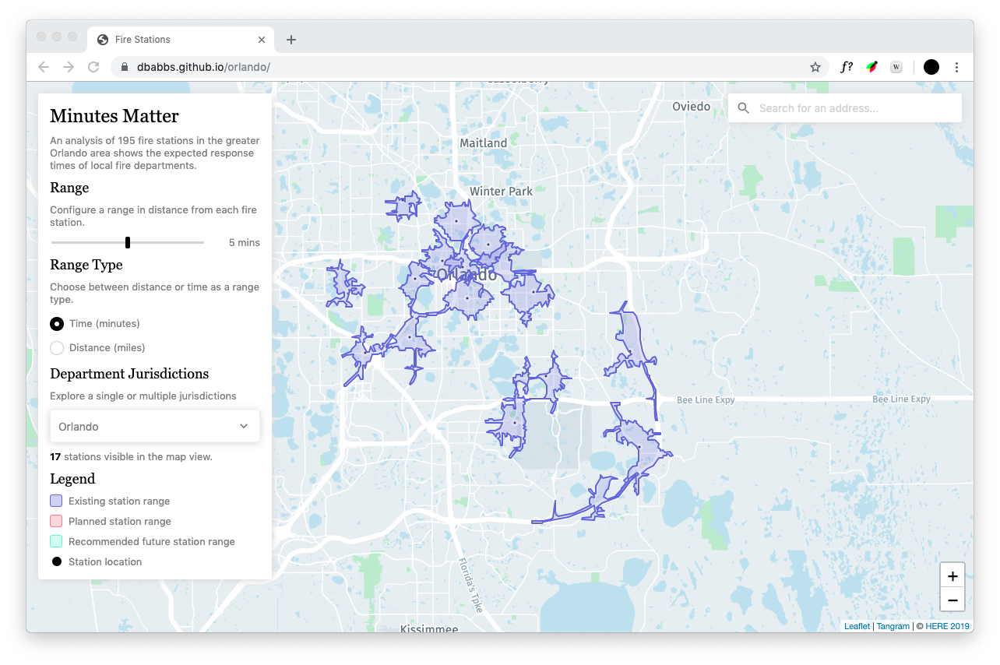

# Orlando Fire Station Reach

Interactive tool to explore the range of fire stations throughout the greater Orlando area.

Tools:
- Isoline data is retrieved from the HERE Routing API.
- Map tiles from [HERE Vector Tile Service](https://developer.here.com/documentation/vector-tiles-api/dev_guide/index.html). OMV format (Optimized Map for Visualization).
- Leaflet and Tangram for map control and rendering.